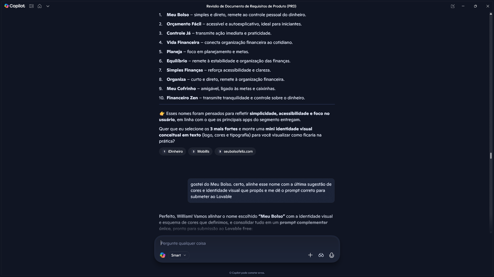
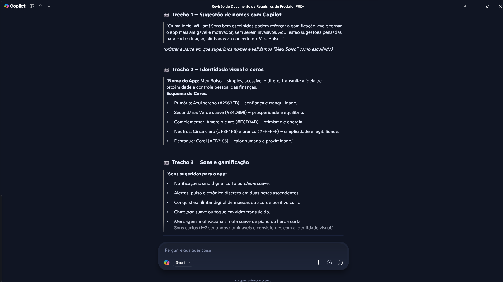
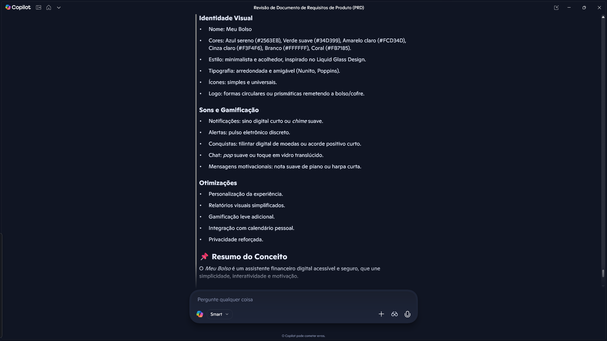
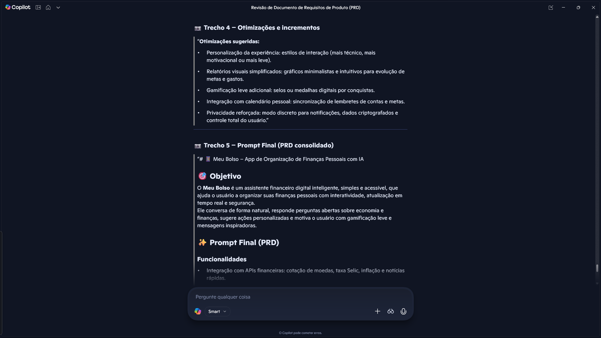
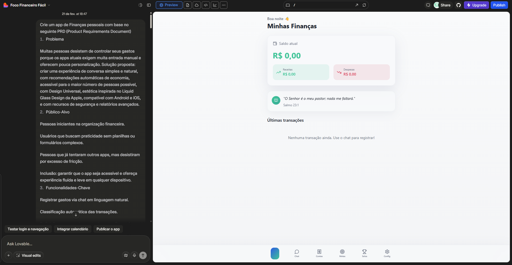

# 📱 Meu Bolso – App de Organização de Finanças Pessoais com IA

## 🎯 Objetivo
O **Meu Bolso** é um assistente financeiro digital inteligente, simples e acessível, que ajuda o usuário a organizar suas finanças pessoais com interatividade, atualização em tempo real e segurança.  
Ele conversa de forma natural, responde perguntas abertas sobre economia e finanças, sugere ações personalizadas e motiva o usuário com gamificação leve e mensagens inspiradoras.

---

## ✨ Prompt Final (PRD)

### Funcionalidades
- Integração com APIs financeiras: cotação de moedas, taxa Selic, inflação e notícias rápidas.  
- Respostas abertas e didáticas: explicações claras e contextualizadas sobre finanças.  
- Interatividade personalizada: recomendações baseadas em hábitos e metas do usuário.  
- Metas financeiras: reserva de emergência e caixinhas com contribuições periódicas.  
- Privacidade e segurança: dados criptografados, modo discreto para notificações e controle total do usuário.  
- Experiência motivacional: mensagens bíblicas diárias e resumo interativo das finanças.

### Identidade Visual
- Nome: Meu Bolso  
- Cores: Azul sereno (#2563EB), Verde suave (#34D399), Amarelo claro (#FCD34D), Cinza claro (#F3F4F6), Branco (#FFFFFF), Coral (#FB7185).  
- Estilo: minimalista e acolhedor, inspirado no Liquid Glass Design.  
- Tipografia: arredondada e amigável (Nunito, Poppins).  
- Ícones: simples e universais.  
- Logo: formas circulares ou prismáticas remetendo a bolso/cofre.  

### Sons e Gamificação
- Notificações: sino digital curto ou *chime* suave.  
- Alertas: pulso eletrônico discreto.  
- Conquistas: tilintar digital de moedas ou acorde positivo curto.  
- Chat: *pop* suave ou toque em vidro translúcido.  
- Mensagens motivacionais: nota suave de piano ou harpa curta.  

### Otimizações
- Personalização da experiência.  
- Relatórios visuais simplificados.  
- Gamificação leve adicional.  
- Integração com calendário pessoal.  
- Privacidade reforçada.  

---

## 📌 Resumo do Conceito
O *Meu Bolso* é um assistente financeiro digital acessível e seguro, que une simplicidade, interatividade e motivação.  
Ele ajuda o usuário a organizar suas finanças pessoais, acompanhar metas, receber lembretes amigáveis e celebrar conquistas com gamificação leve.  
Tudo isso com uma identidade visual clara e sons sutis que tornam a experiência mais humana e próxima.

---

## 📷 Interações com IA

### 1. Sugestão de nomes com Copilot

### 2. Identidade visual e cores

### 3. Sons e gamificação

### 4. Otimizações e incrementos

### 5. Prompt final consolidado no Lovable

---

## 💡 Reflexão
Durante o desenvolvimento deste PRD, aprendi a importância de estruturar ideias de forma clara e objetiva, usando IA como parceira criativa.  
O processo mostrou como prompts bem elaborados podem transformar conceitos em projetos reais, e como a combinação de tecnologia, design e experiência do usuário gera soluções relevantes para o mercado.

---

## 🚀 Entrega
Este repositório faz parte do desafio da DIO:  
[dio-lab-vibe-coding-app-financas](https://github.com/digitalinnovationone/dio-lab-vibe-coding-app-financas)
